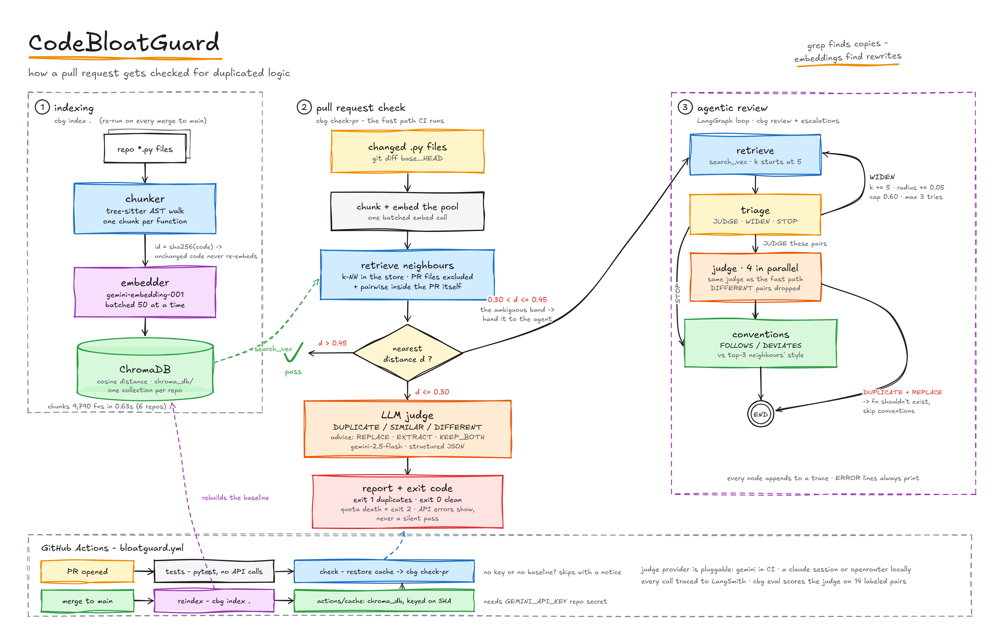
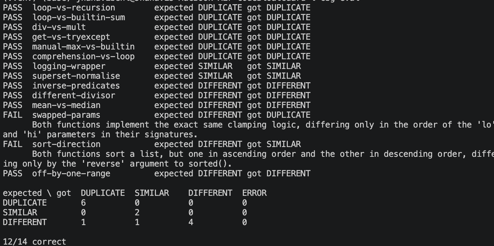

# CodeBloatGuard

[](https://github.com/jhanaviB/CodeBloatGuard/actions)
[](https://www.python.org/downloads/)
[](https://github.com/psf/black)


This repo contains an agentic AI PR reviewer that uses repo-aware retrieval and multi-stage reasoning to detect duplicate logic and assess code reuse potential in python repos.
The retriever finds candidates by semantic meaning instead of an exact word match. 
When new code is added, it is compared with existing code to determine if there is an exact match or a similarity. Depending on the action, the judge model gives an advise.
A triage model is an optimization step that decides whether the next step is a judge, widen or stop action.

The default models are:
Embedding model: `gemini-embedding-001`
Judge model: `gemini-2.5-flash`
Triage model: `gemini-2.5-flash`

`llm.py` has code to integrate AWS Bedrock, Claude SDK and Openrouter as well.

The tech stack for CodeBloatGuard is:

- __Language__: Python 3.11+

- __LLM/AI Integration__:

  - `google-genai` (for Gemini)
  - `langgraph` (for agentic workflows)
  - `langsmith` (for observability/tracing)
  - `claude-agent-sdk` (optional, for local Claude integration)

- __Vector Database__: `chromadb`

- __Code Analysis__: `tree-sitter` and `tree-sitter-python`

- __Environment Management__: `python-dotenv`

- __Testing__: `pytest`

- __CI/CD__: GitHub Actions




## The Problem This Solves

**Before CodeBloatGuard:**
- Developers add duplicate functions without knowing similar code exists
- Code reviews catch some duplicates, miss others
- `grep` finds exact matches, misses semantic duplicates
- Lots of time spent by team to review code

**After CodeBloatGuard:**
- Automatic duplicate detection on every PR
- Semantic search finds similar logic, not just matching words
- LLM judge explains *why* code needs to be updated or not

**Real example:**
```python
# These are duplicates, but grep wouldn't find them
def factorial(n):
    r = 1
    for i in range(2, n + 1):
        r *= i
    return r

def fact(x):
    return 1 if x <= 1 else x * fact(x - 1)


## Setup

```bash
pip install -e .
echo 'GEMINI_API_KEY=your-key-here' > .env
```

Tests need neither:

```bash
pip install -e '.[dev]'
pytest
```

## Usage

```bash
cbg index .                                  # build the index
cbg check src/yourmodule/thing.py --repo .   # fast path, fixed threshold
cbg review src/yourmodule/thing.py --repo .  # agentic path, model picks the radius
```

Both exit 1 when duplicates are found.

| Command | |
| --- | --- |
| `cbg index <repo>` | Reconcile the store with disk. Idempotent. |
| `cbg check <file>` | Flag code that exists elsewhere. Fixed threshold. |
| `cbg review <file>` | Same, but the model decides search width. |
| `cbg check-pr` | Files a PR changed. Fast path, escalating near misses. |
| `cbg chunk <repo>` | Show the function split. No API calls. |
| `cbg search <code>` | Nearest indexed functions for a snippet. |
| `cbg judge <a> <b>` | Verdict on two snippets, no retrieval. |
| `cbg eval` | Score the judge on 14 labeled pairs. |
| `cbg benchmark <repo>...` | Chunker throughput. No API calls. |
| `cbg stats` | Chunks indexed. |

`--no-judge` prints retrieval distances without calling any model. Use it to calibrate the threshold on a new repo.

## How it works

`chunker` (tree-sitter) splits files into functions → `embedder` (Gemini) embeds them → `store` (ChromaDB) does cosine retrieval. Chunk ids hash content, so unrelated edits don't re-embed.

**`check`**: everything under `DUP_DISTANCE` goes to the judge (DUPLICATE / SIMILAR / DIFFERENT + fix). Fast, deterministic — good for CI.

**`review`**: a LangGraph loop — retrieve → triage (judge / widen / stop) → judge (parallel, 4 at a time) → conventions. Triage widens retrieval when the fixed threshold doesn't fit; conventions checks naming/style precedent against neighbors, skipped only when a DUPLICATE is being replaced outright.

**`check-pr`** runs both: fast path first, escalates to the graph only when a match falls in the ambiguous band between `DUP_DISTANCE` and `ESCALATE_DISTANCE`.

API errors always return ERROR, never a false pass. Daily quota errors abort the run instead of retrying (retrying can't restore a quota that resets tomorrow).

## Observability and evals

```bash
LANGSMITH_TRACING=true
LANGSMITH_API_KEY=your-key
```

`cbg eval` scores the judge against 14 hard labeled pairs in `evalset.py`. `--upload` pushes to LangSmith.



## Tests

```bash
pytest   # 75 tests, no key, no network, ~1s
```

Embedder is faked as a bag-of-tokens vector; Chroma runs for real against a temp dir.

## CI

`.github/workflows/bloatguard.yml`: `tests` runs pytest on every push/PR. 
`check` runs `cbg check-pr` on changed files. `reindex` runs on merge to main to refresh the shared store/cache.


<!--
## Measured on real repos

Chunking throughput (free, no API calls):

| repo | files | lines | functions | seconds |
| --- | ---: | ---: | ---: | ---: |
| [fastapi](https://github.com/fastapi/fastapi) | 1,130 | 111,711 | 4,897 | 0.37 |
| [click](https://github.com/pallets/click) | 78 | 28,104 | 1,705 | 0.10 |
| [flask](https://github.com/pallets/flask) | 83 | 18,337 | 1,437 | 0.05 |
| [httpie/cli](https://github.com/httpie/cli) | 133 | 19,002 | 1,063 | 0.06 |
| [requests](https://github.com/psf/requests) | 37 | 12,032 | 688 | 0.04 |
| **total** | **1,461** | **189,186** | **9,790** | **0.63** |

~2,300 files/sec — matters because a re-index only embeds what changed, so the "what changed" walk must be cheap enough to run every commit.

On `psf/requests`, retrieval alone doesn't separate signal: real code has no clean distance gap like the toy fixture does, so every reported finding goes through the judge, and the threshold needs per-repo calibration (`--no-judge`).

## Distributing

Not yet published.

```bash
python -m pip install build twine
python -m build
python -m twine upload dist/*
```

Blocker: `PROJECT_ROOT` in `config.py` resolves relative to the installed package, so a non-editable install puts the store inside site-packages. Needs to derive from the indexed repo instead.

## Known limits

- Python only, functions only.
- `DUP_DISTANCE` (0.30) / `ESCALATE_DISTANCE` (0.45) calibrated on a small fixture — verify on real repos.
- Escalation makes PR cost non-deterministic.
- Two identically-named, identical-body functions in one file collide on chunk id; only one is stored.
- `cbg search` embeds a bare snippet vs. indexed documents' `# file:`/`# symbol:` header — distances aren't directly comparable to `cbg check`.
- Judging isn't prioritized; a PR that exhausts quota may not have judged its closest pairs.
- Local and CI indexes are separate; local results are advisory.
- Store is a local Chroma directory (swap for a Chroma server in `store.py`).
-->
